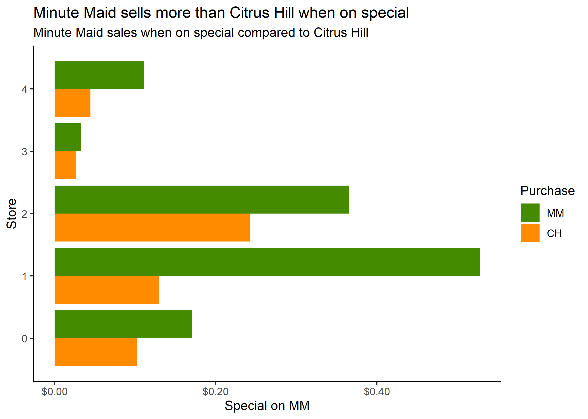

#### Comparison of Minute Maid and Citrus Hill purchases at different stores

***

```{r include = FALSE}
# Set chunk options for the file
knitr::opts_chunk$set(echo = FALSE, message = FALSE, warning = FALSE)
```

```{r}
# Course: OMSBA 5210
# Purpose: Participation Assignment #2
# Date: 7/1/2021
# Author: Andrew Nalundasan
```

```{r}
# Load libraries
library(tidyverse)
```

```{r}
# Load and prepare data 
oj <- read_csv("OJ_data.csv")
```

```{r}
# Make calculations for memo text

# Median PriceMM by store
med_purch <- oj %>% 
  group_by(STORE) %>% 
  summarize(med_purch = median(PriceMM)) %>% 
  pull(med_purch) %>% 
  median()

# Max and Min PriceMM by store

# max
max_store_purch <- oj %>% 
  group_by(STORE) %>% 
  summarize(max_purch = max(PriceMM))

max_purch <- oj %>% 
  group_by(STORE) %>% 
  summarize(med_purch = median(PriceMM)) %>% 
  pull(med_purch) %>% 
  max()

# min
min_store_purch <- oj %>% 
  group_by(STORE) %>% 
  summarize(min_purch = min(PriceMM))

min_purch <- oj %>% 
  group_by(STORE) %>% 
  summarize(med_purch = median(PriceMM)) %>% 
  pull(med_purch) %>% 
  min()


# Sample size by store
n_store <- oj %>% 
  group_by(STORE) %>% 
  summarize(n_store = n()) %>% 
  pull(n_store)
```

An analysis of orange juice (OJ) purchases was made across a sample of five different stores, all running different discount specials between Minute Maid (MM) and Citrus Hill (CH) OJ brands. Across all stores, the maximum price that Minute Maid (MM) was purchased  was `r max_purch` while the minimum price was `r min_purch`. The median price for MM purchases was `r med_purch`. 

The graph shown below indicates that when MM is on special, MM experiences a higher number of purchases over Citrus Hill (CH), MM's main competitor. When MM is running a 40 cent discount, sales at Store 1 skyrocket compared to CH sales. Discounts of ~5 cents do not make much of a difference in sales for either brand as shown by Store 3. 

{width=500px}

The number of stores surveyed differed from each other. Store 0 had `r n_store[1]` stores, Store 1 had `r n_store[2]` stores, Store 2 had `r n_store[3]` stores, Store 3 had `r n_store[4]` stores, and Store 4 had `r n_store[5]` stores. A future study could be held where the counts of each store is balanced to better analyze the performance of discounts on the different brands of OJ.

Please reach out with any questions you may have, I'd be happy to discuss the analysis further. Email is the best way to reach me: analundasan@seattleu.edu. I've also attached the Technical Appendix with my complete EDA performed for this participation assignment. 

Thanks,

Andrew


